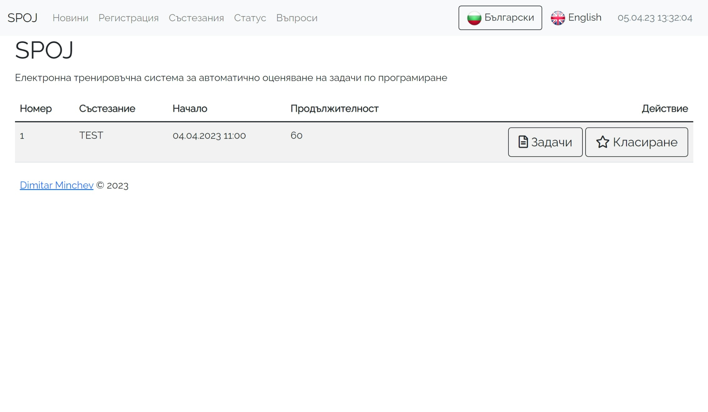
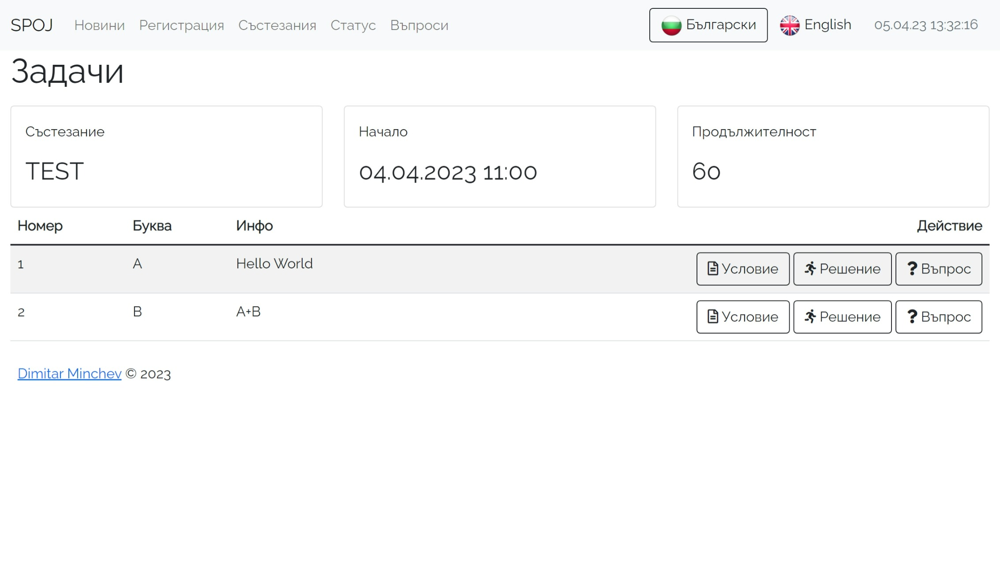
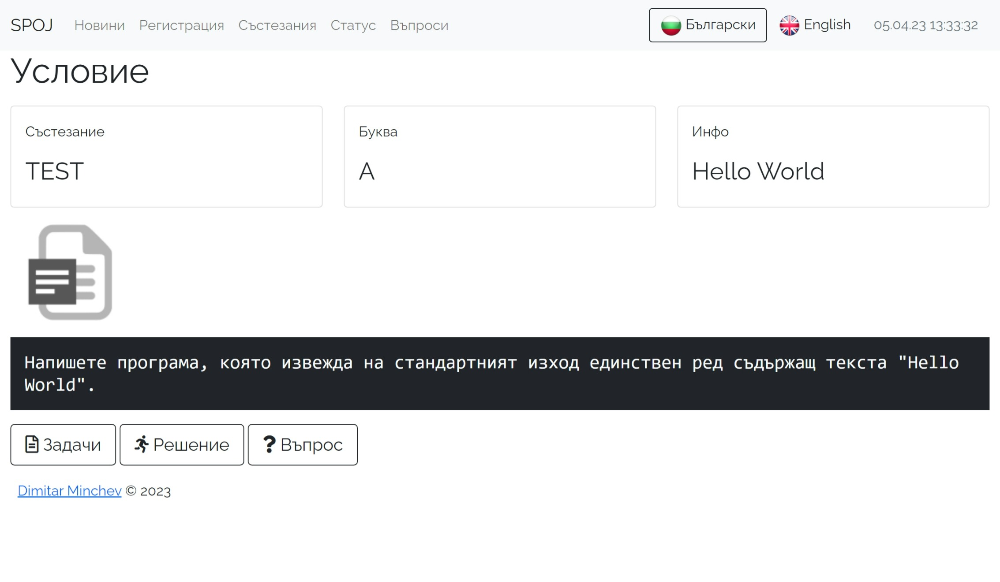
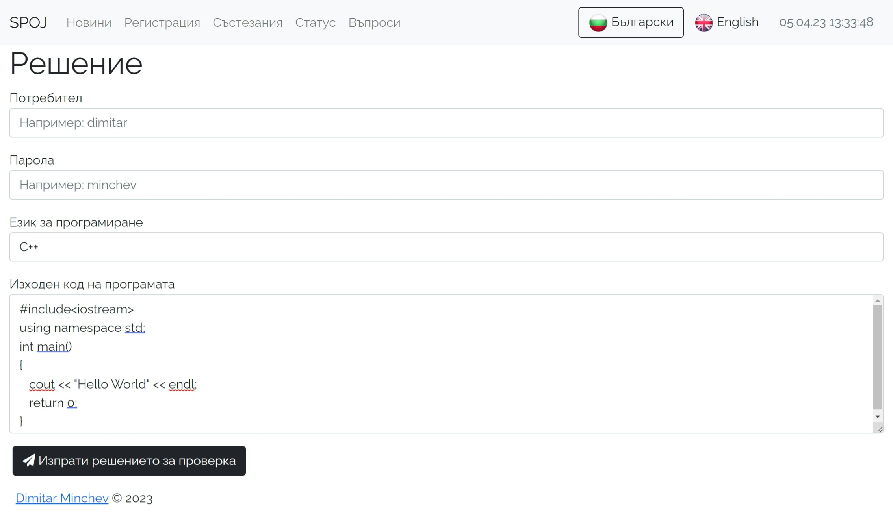
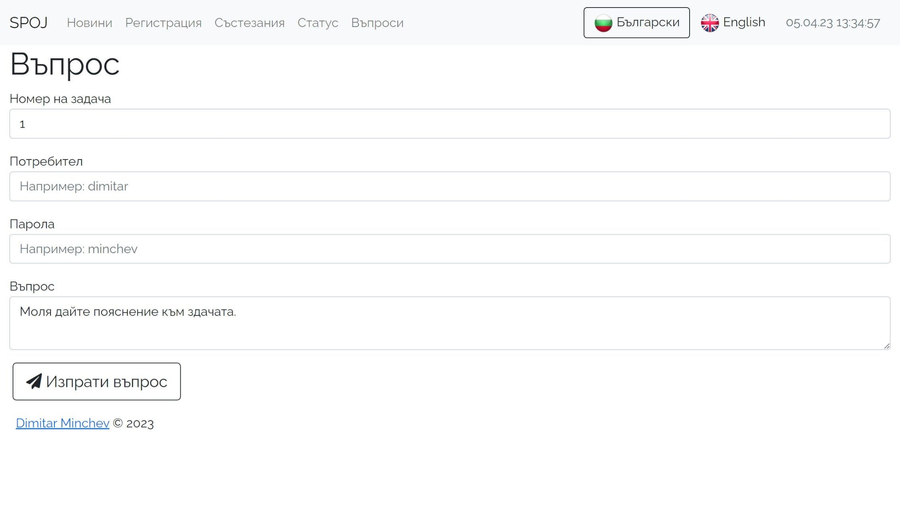
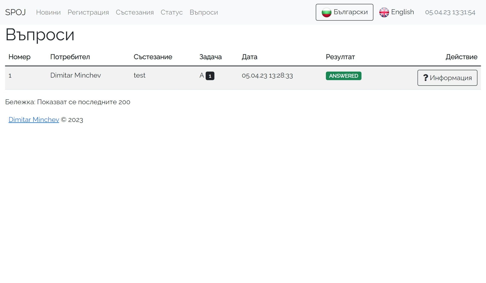
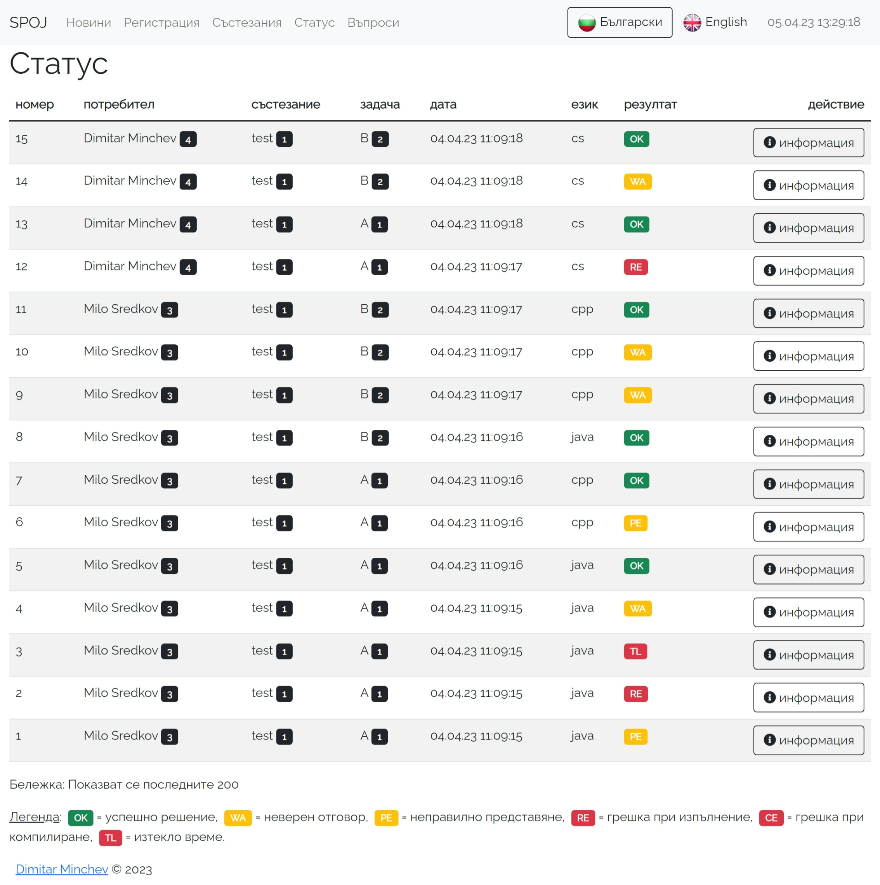

# Инструкция за състезателите
Списък с налични състезания е достъпен на страница **СЪСТЕЗАНИЯ**.

Избирайки бутон **ЗАДАЧИ** се зарежда списък с налични задачи за съответното състезание.

 
Избирайки бутон **УСЛОВИЕ** ще видите условието на съответната задача, което може да бъде налично като TXT, DOC и/или PDF файл.
 

Избирайки бутон **РЕШЕНИЕ** имате възможност да поставите изходния код за решение на съответната задача. По регламент официалният програмен език е C++, но състезателната система поддържа още C# и JAVA.

 
 
Избирайки бутон **ВЪПРОС** можете да зададете уточняващ въпрос.

 

На страница **ВЪПРОСИ** следете за отговор на вашия въпрос.
 
 

На страница **СТАТУС** се показват резултати от обработката на изпратените задачи. 
 
 

Възможните състояния са: 
- OK = успешно решение
- WA = грешен отговор
- PE = неправилно представяне
- RE = грешка при изпълнение
- CE = грешка при компилиране
- TL = изтекло време
