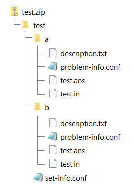

## Contest Set Sample
This folder contains contest set sample folder and files structure of 1 contest with 2 tasks.

### Download 
- [test.zip](test.zip)
- [test.samples.zip](test.samples.zip)

### Preview


### Content
```
sets
├── test.samples
│   ├── ab_ok.class
│   ├── ab_ok.cpp
│   ├── ab_ok.cs
│   ├── ab_ok.java
│   ├── ab_pe.cpp
│   ├── ab_wa.cpp
│   ├── hello_ok.class
│   ├── hello_ok.cpp
│   ├── hello_ok.cs
│   ├── hello_ok.java
│   ├── hello_pe.cpp
│   ├── hello_pe.java
│   ├── hello_re.java
│   ├── hello_tl.java
│   └── hello_wa.java
├── test
│   ├── a
│   │   ├── description.txt
│   │   ├── problem-info.conf
│   │   ├── test.ans
│   │   └── test.in
│   ├── b
│   │   ├── description.txt
│   │   ├── problem-info.conf
│   │   ├── test.ans
│   │   └── test.in
│   └── set-info.txt
├── dos2unix.sh
├── readme.md
├── test.png
├── test.samples.zip
└── test.zip
```
_Updated: 11.04.2023_
